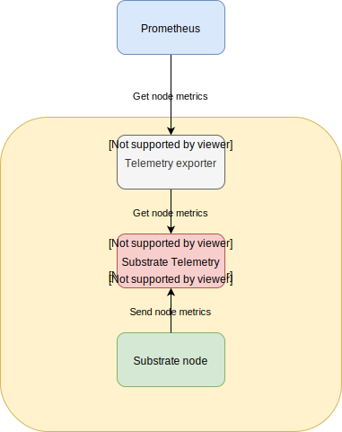
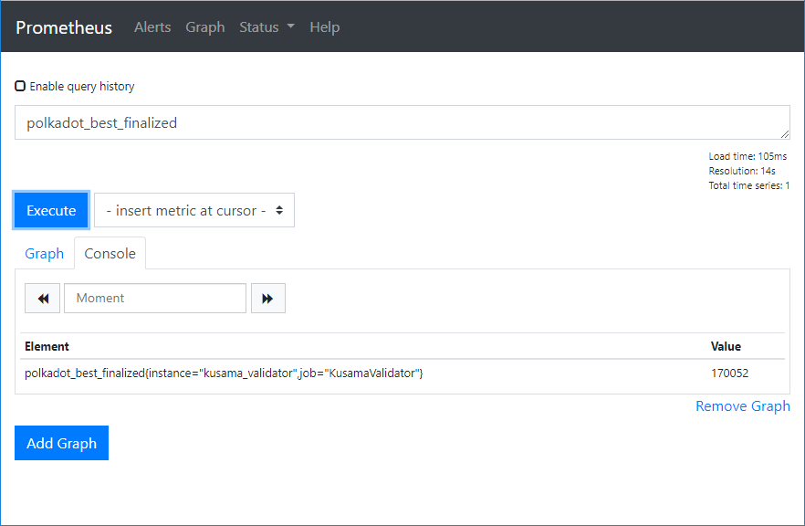

[](https://circleci.com/gh/w3f/substrate-telemetry-exporter)

# Substrate Telemetry Exporter

Substrate Telemetry Exporter allows you to expose Substrate node metrics collected by a [Substrate Telemetry](https://github.com/paritytech/substrate-telemetry) server to a [Prometheus](https://prometheus.io/)/[Grafana](https://grafana.com/) based monitoring system.

Currently there is no way to get per node metrics from a Telemetry server, so hence the need of run a local Telemetry + Telemetry Exporter in each node you want to monitor. That setup allows you to fetch metrics from individual nodes in Prometheus.

If it is your case you don't need to run the Telemetry frontend. Note that you can especify severals telemetry servers in your susbtrate node start flags (i.e: one local telemetry to get metrics and the public [Telemetry server](https://telemetry.polkadot.io))

Above you can see a diagram of the components, ports and flows involved in a localhost telemetry + exporter escenario:



* The substrate node will send their metrics to a local Substrate Telemetry server.
* Telemetry Exporter (also running locally) will connect to Telemetry server and expose node metrics to Prometheus.
* Prometheus will then scrape node metrics at a specified scrape interval.
* Finally you will be able to create graphs, alerts and dashboards based on that metrics in Grafana.

## Install

```
cd /usr/local/
git clone https://github.com/w3f/substrate-telemetry-exporter
cd substrate-telemetry-exporter
yarn
```

## Run

With Forever:

```
forever start -l /var/log/telemetry.exporter.log -a /usr/local/substrate-telemetry-exporter/src/index.js
```

For production sites it's recommended that you configure it as a systemd service to automatically start at system bootup.

## Check logs

```
# tail -f /var/log/telemetry.exporter.log
New best block 170347
Block 170347 imported at node 2
data: [10,1570565169413]
data: [1,[170348,1570565171517,9942],6,[2,[170348,"0xaccdf9b375ca420572bb27f21623818b974d1209a1d19f9a0a7ad8bc644f19f4",10743,1570565171517,0]]]
New best block 170348
Block 170348 imported at node 2
data: [10,1570565179416]
data: [1,[170349,1570565180073,9747.8],6,[2,[170349,"0x9dc6e84177d1fdb7b766239f454991945629003bdafb44a89df713d8b55d1be5",8557,1570565180073,0]]]
New best block 170349
Block 170349 imported at node 2
data: [10,1570565189417]
^C
```

## Configure polkadot node

We need polkadot node to send their metrics to local Substrate Telemetry server, so we must start the polkadot daemon with the flag `--telemetry-url` like:

```
/usr/local/polkadot/target/release/polkadot --telemetry-url ws://127.0.0.1:1024 ... rest of your flags
```

## Configure Prometheus

Now we need to add our new data source at the end of the prometheus.yaml config file (in scrape_configs: section):

```
 - job_name: 'YourSubstrateNode'
    scrape_interval: 5s
    static_configs:
    - targets: ['YOUR_SUBSTRATE_NODE_IP:3000']
      labels:
        instance: 'your_substrate_node_name'
```

Save and restart your prometheus server, open the web interface and now you are able to query the new node metrics.


